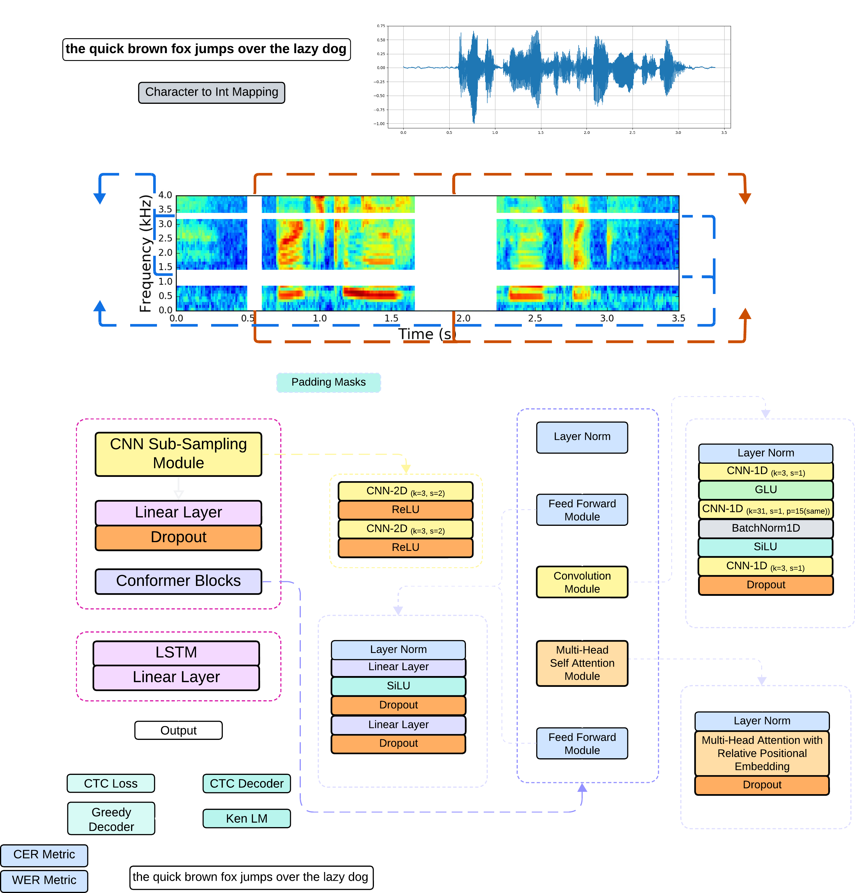
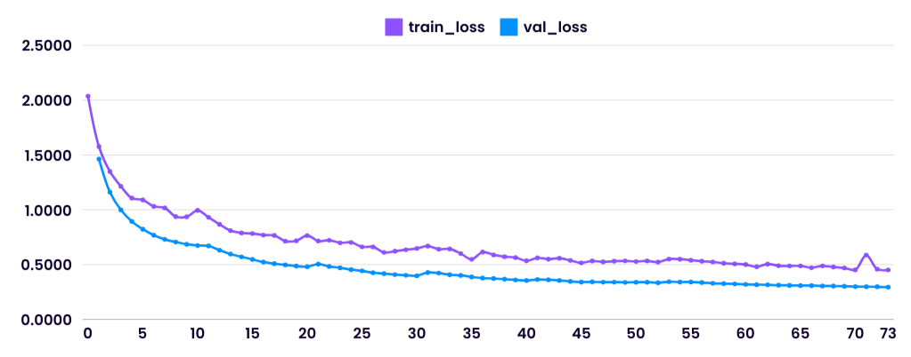
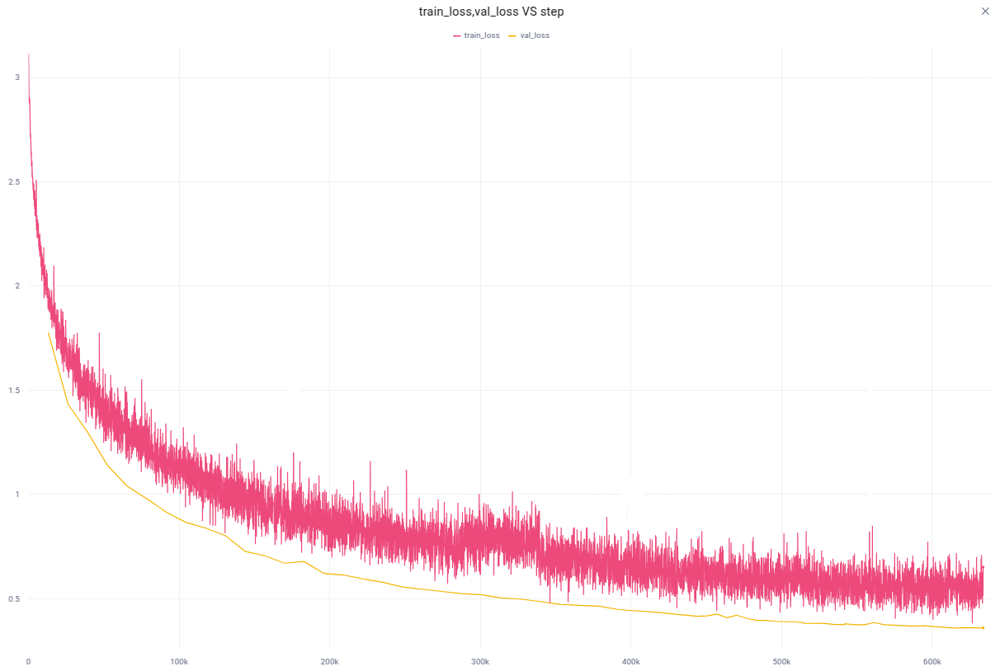

# Conformer: Convolution-Augmented Transformer for Speech Recognition

<div align="center">
  
  
  
  
  
</div>

<p align="center">
  
</p>

This repository contains a complete implementation of the [**Conformer**](https://arxiv.org/abs/2005.08100): Convolution-Augmented Transformer for Speech Recognition. It includes:

- 🚀 Efficient training pipeline (with Lightning)
- 🌐 Web inference demo (Gradio + Flask)
- 🔤 Beam search decoding with KenLM

---

## 📚 References

- [Attention Is All You Need](https://arxiv.org/pdf/1706.03762)
- [Conformer: Convolution-augmented Transformer](https://arxiv.org/pdf/2005.08100)
- [Transformer-XL](https://arxiv.org/pdf/1901.02860)
- [KenLM](https://kheafield.com/code/kenlm/)
- [Beam Search + LM Decoding](https://towardsdatascience.com/boosting-your-sequence-generation-performance-with-beam-search-language-model-decoding-74ee64de435a)

---

## 🛠 Installation

### 1. Clone & Setup
```bash
git clone https://github.com/LuluW8071/Conformer.git
cd Conformer
```

### 2. Install Dependencies

First, install system-level requirements:

```bash
sudo apt update
sudo apt install sox libsox-fmt-all build-essential zlib1g-dev libbz2-dev liblzma-dev
```

Then Python packages:
```bash
pip install -r requirements.txt
```

Ensure __CUDA + PyTorch__ are correctly set up for training.

---

## 📁 Data Preparation

### 🔊 1. Common Voice Conversion
```bash
python3 common_voice.py \
    --file_path /path/to/validated.tsv \
    --save_json_path converted_clips \
    -w 4 \
    --percent 10
```

> _**LibriSpeech** ASR corpus is automatically downloaded._

### 🎙️ 2. Personal Recordings via [Mimic Record Studio](https://github.com/MycroftAI/mimic-recording-studio)

> [!IMPORTANT]
> **Recommended:** At least 1–2 hours of personal recordings.Original audio is augmented (e.g., noise, pitch, speed) to boost variation in recorded corpus and improve model robustness on your voice.

```bash
python3 mimic_record.py \
    --input_file /path/to/transcript.txt \
    --output_dir /path/to/save
```

### 🧩 3. Merge JSON Files
```bash
python3 merge_jsons.py personal/train.json converted_clips/train.json \
    --output merged_train.json
```

> Repeat for validation files.

## 🏋️‍♀️ Training

Add your Comet ML API key and project to `.env`.

```bash
python3 train.py \
    -g 4 \                    # Number of GPUs
    -w 8 \                    # CPU workers
    --epochs 100 \            # Training epochs
    --batch_size 32 \         # Batch size
    -lr 4e-5 \                # Learning rate
    --precision 16-mixed \    # Enable mixed precision
    --checkpoint_path /path/to/checkpoint.ckpt  # (Optional) Resume training
```

## 📦 Model Export

Export to TorchScript for optimized inference:
```bash
python3 torchscript.py \
    --model_checkpoint /path/to/checkpoint.ckpt \
    --save_path model
```

## 🧪 Inference

### Gradio Demo
```bash
python3 gradio_demo.py \
    --model_path /path/to/optimized_model.pt \
    --share
```

### Flask Web App
```bash
python3 app.py \
    --model_path /path/to/optimized_model.pt
```

> 🔎 See the [Jupyter notebook](notebooks/Conformer_Inference_With_CTC_Decoder.ipynb) for interactive inference examples.

---

## 📊 Experiment Details

### 📂 Datasets

| Dataset                            | Use       | Hours         | Notes                            |
|-----------------------------------|-----------|---------------|----------------------------------|
| Mozilla Common Voice 7.0 + Personal | Training  | 1855 + 20     | Large crowd-sourced + personal  |
|                                   | Validation| 161 + 2       | 8% Validation split              |
| LibriSpeech                        | Training  | 960           | Full training set                |
|                                   | Validation| 10.5          | Test-clean, Test-other           |

### 🛠️ Training Configuration

| Parameter            | Value           |
|----------------------|-----------------|
| `batch_size`         | 64              |
| `precision`          | mixed precision |
| `grad_clip`          | 0.6             |
| `learning_rate (AdamW)` | 1e-4         |
| `scheduler`          | ReduceLROnPlateau |

---

### 📉 Loss Curves

| LibriSpeech | Mozilla Corpus + Personal | 
|-------------|---------------------------|
|  |  | 

|Combined |
|-------------|
|  |

### 🧠 Greedy Decoding

| Exp. | Dataset                                | Eval WER | Test-Clean WER | Test-Other WER | Model |
|------|----------------------------------------|------------|------------|------------|--------|
| 1    | LibriSpeech                            | 22.94      | 15.94      | 31.71      | [🔗](https://drive.google.com/file/d/1XcouMWSncUeNBvGZednuWYK1jdfKisCr/view?usp=drive_link) |
| 2    | Mozilla + Personal                     | 25.29      | 26.22      | 42.59      | [🔗](https://drive.google.com/file/d/1b_ElF1ihnI1H4dTlGzAQQJZzgOt0jqiv/view?usp=drive_link) |
| 3    | Combined (Mozilla + Libri + Personal)  | 28.47      | 19.33      | 33.50      | [🔗](https://drive.google.com/file/d/1J0XCK31raK5cYQoueOX42iHFy5L0BADU/view?) 

> ⚠️ Mozilla eval set is ~15× larger than LibriSpeech eval set.


### 🧠 Beam Search + Language Model Decoding

> [!NOTE]
> - Using Experiment No.3 Conformer model and LibriSpeech 4-gram KenLM
> - **Parameter**: `beam_size` - `beam_threshold` - `beam_size_token` - `lm_weight`
> - `word_score` = -0.26
> - $Greedy$ = **No CTC Beam Search + No LM**
> - `lm_weight` = $None$ means **CTC Beam Search but no LM**

Parameter | Test-Clean WER | Test-Clean CER | Test-Other WER | Test-Other CER |
|-|-|-|-|-|
$Greedy$ | 19.33 | 5.75 | 33.50 | 12.44
$50$ - $25$ - $15$ - $None$ | 16.04 | 5.82 | 30.86 | 13.80
$100$ - $50$ - $25$ - $None$ | 15.83 | 5.50 | 30.48 | 13.11
$50$ - $25$ - $15$ - $3.23$ | 11.01 | 5.43 | 23.93 | 13.90
$50$ - $25$ - $15$ - $1.23$ | 9.46 | 3.93 | 20.89 | 10.40
$100$ - $50$ - $25$ - $1.23$ | 9.21 | 3.76 | 20.32 | 10.03
$250$ - $75$ - $25$ - $1.23$ | 9.00 | 3.66 | 19.97 | 9.74
$500$ - $100$ - $30$ - $1.23$ | 8.94 | 3.61 | 19.74 | 9.62
$1000$ - $250$ - $100$ - $1.23$ | **8.88** | **3.61** | **19.59** | **9.53**

> As the parameters of the beam search decoder—such as beam width or number of hypotheses—increase, the inference time also increases due to the additional computational overhead required to explore more decoding paths.

<!--
Custom KEN LM trained on preprocessed sentences of Mozilla corpus gave 
Test-Clean | WER: 12.44 - CER: 4.80
Test-Other | WER: 24.37 - CER: 11.41
Do note: Size of Librispeech LM: 2.2GB while custom that i trained had 260 MB
-->

---

## 📌 Citation

```bibtex
@misc{gulati2020conformer,
  title={Conformer: Convolution-augmented Transformer for Speech Recognition},
  author={Anmol Gulati, James Qin, Chung-Cheng Chiu et al.},
  year={2020},
  url={https://arxiv.org/abs/2005.08100}
}
```
