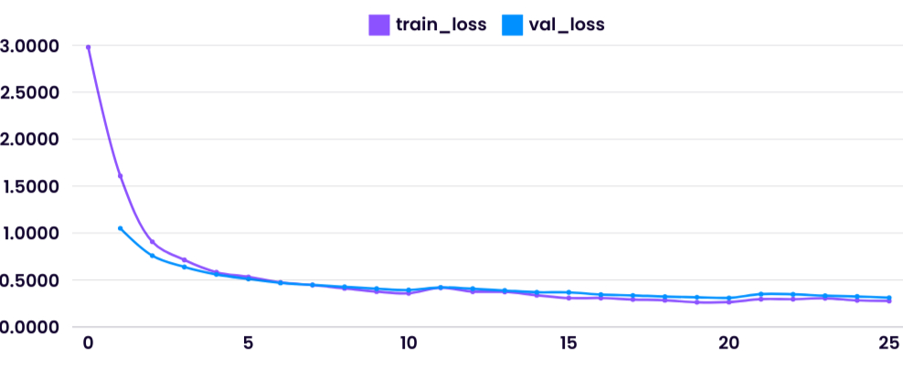

# Conformer: Convolution-augmented Transformer for Speech Recognition

<div align="center">

    

</div>


This repository provides an implementation of the paper *__Conformer__: Convolution-augmented Transformer for Speech Recognition*. It includes training scripts including support for distributed GPU training using **Lightning AI** and web-app for inference using __Gradio__ and __CTC-Decoder with KenLM__. 

## 📄 Paper and Blog References

- [x] [__Attention Is All You Need__](https://arxiv.org/pdf/1706.03762)
- [x] [__Conformer__: Convolution-augmented Transformer for Speech Recognition](https://arxiv.org/pdf/2005.08100)
- [x] [__Transformer-XL__: Attentive Language Models Beyond a Fixed-Length Context](https://arxiv.org/pdf/1901.02860)
- [x] [__KenLM__](https://kheafield.com/code/kenlm/)
- [x] [__Boosting Sequence Generation Performance with Beam Search Language Model Decoding__](https://towardsdatascience.com/boosting-your-sequence-generation-performance-with-beam-search-language-model-decoding-74ee64de435a)

---

## Installation

### 1. Clone the Repository
```bash
git clone https://github.com/LuluW8071/Conformer.git
cd Conformer
```

### 2. Install Dependencies

Before installing dependencies, ensure the following are installed:

- **CUDA Toolkit** (For Training)
- **PyTorch** (CPU or GPU version)  
- **SOX**
  ```bash
  sudo apt update
  sudo apt install sox libsox-fmt-all build-essential zlib1g-dev libbz2-dev liblzma-dev
  ```

Install the remaining dependencies:
```bash
pip install -r requirements.txt
```

---

## Usage

### Audio Preprocessing

#### 1. Common Voice Conversion
To preprocess the Common Voice dataset:
```py
python3 common_voice.py \
    --file_path /path/to/validated.tsv \
    --save_json_path converted_clips \
    -w 4 \
    --percent 10
```

#### 2. Personal Recordings
To record your own voice, use [__Mimic Record Studio__](https://github.com/MycroftAI/mimic-recording-studio) and prepare it for training :

```py
python3 mimic_record.py \
    --input_file /path/to/transcript.txt \
    --output_dir /path/to/save \
    --percent 20 \
    --upsample 5  # Duplicate 5 times in train json only
```

> **Note**: The `--upsample` flag duplicates train json only to increase sample size.

#### 3. Merge JSON Files
Combine personal recordings and datasets into a single JSON file:
```py
python3 merge_jsons.py personal/train.json converted_clips/train.json \
    --output merged_train.json
```
> Perform same operation for validation json file.
---

### Training

Before starting, add your **Comet ML API key** and **project name** to the `.env` file.

To train the Conformer model:
```py
python3 train.py \
    -g 4 \                    # Number of GPUs
    -w 8 \                    # Number of CPU workers
    --epochs 100 \            # Number of epochs
    --batch_size 32 \         # Batch size
    -lr 4e-5 \                # Learning rate
    --precision 16-mixed \    # Mixed precision training
    --checkpoint_path /path/to/checkpoint.ckpt  # Optional: Resume from a checkpoint
```

### Exporting the Model
In order to serialize the model allowing for better optimization to run in C++ level runtimes, export the PyTorch model using torchscript.

```py
python3 torchscript.py \
    --model_checkpoint /path/to/checkpoint.ckpt \
    --save_path /path/to/optimized_model.pt
```

### Inference
##### Gradio Demo

```py
python3 gradio_demo.py \
    --model_path /path/to/optimized_model.pt \
    --share     # Optional: To share the Gradio app publicly
```

##### Web Flask Demo
```py
python3 app.py \
    --model_path /path/to/optimized_model.pt
```

> See [notebook](https://github.com/LuluW8071/Conformer/blob/main/notebooks/Conformer_Inference_With_CTC_Decoder.ipynb) for inference examples.

---

## Experiment Details

### Datasets

| **Dataset** | **Usage** | **Duration (Hours)** | **Description** |
|-------------|-----------|-----------------------|-----------------|
| Mozilla Common Voice 7.0 + Personal Recordings | Training | ~1855 + 20 | Crowd-sourced and personal audio recordings |
|             | Validation | ~161 + 2            | Validation split (8%) |
| LibriSpeech | Training   | ~960                | Train-clean-100, Train-clean-360, Train-other-500 |
|             | Validation | ~10.5               | Test-clean, Test-other |

---

### Results

#### Loss Curves

| LibriSpeech | Mozilla Corpus + Personal Recordings |
|-------------|--------------------------------------|
|  |  |

#### Word Error Rate (WER)

> [!NOTE]
>The model trained on the Mozilla Corpus dataset shows a slightly higher WER compared to the LibriSpeech dataset. However, it's important to note that the Mozilla validation was conducted on a dataset 15 times larger than the LibriSpeech validation set.

| Dataset    | WER (%)   | Model Link |
|------------|-----------|------------|
| LibriSpeech | 22.94    | [:link:](https://drive.google.com/file/d/1XcouMWSncUeNBvGZednuWYK1jdfKisCr/view?usp=drive_link) |
| Mozilla Corpus | 25.29 | [:link:](https://drive.google.com/file/d/1b_ElF1ihnI1H4dTlGzAQQJZzgOt0jqiv/view?usp=drive_link) |

> Expected WER with **CTC + KenLM** decoding: **~15%**.

---

## Citation

```bibtex
@misc{gulati2020conformer,
      title={Conformer: Convolution-augmented Transformer for Speech Recognition}, 
      author={Anmol Gulati et al.},
      year={2020},
      url={https://arxiv.org/abs/2005.08100}, 
}
```
